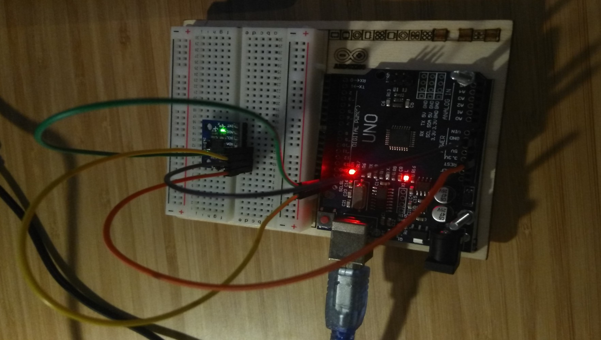
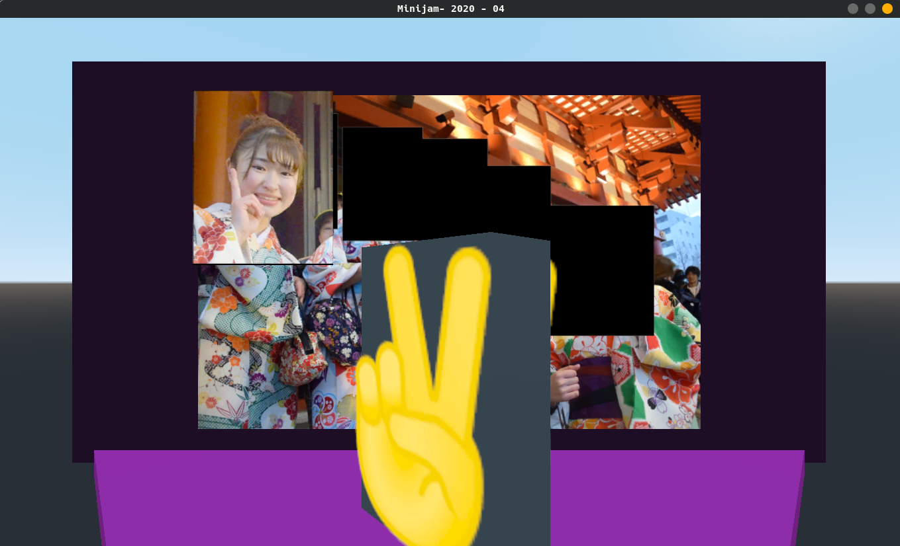

# ✌ Piisu kawaii

A game where you rotate your hand until you match the kawaii girls!

Made at Berlin Mini Jam in April 2020. The theme was `kawaii factor`.

> Note: right now you need the hardware controller to play it.
> Maybe I'll add a keyboard fallback

## Running the game

### Arduino Code

I'm using an Arduino Uno and a [MPU6050](https://duckduckgo.com/?q=mpu+gyro&t=canonical&pn=1&ia=images) (accelerometer and gryro module).

Wiring as follows

| Arduino | MPU |
|---------|-----|
| 3.3V    | VCC |
| GND     | GND |
| SCL     | SCL |
| SDA     | SDA |

Dependencies are [SoftTimer by prampec](https://github.com/prampec/arduino-softtimer) and [MPU6050_tockn by tockn](https://github.com/tockn/MPU6050_tockn/).

The Arduino calculates the angle it's rotated and sends it as CSV over a serial connection (USB).

### Node server

The nodejs server reads the CSV measurements from the Arduino and publishes them over websockets as serialized JSON.

To start the server install node dependencies and run either

`$ yarn install && yarn server`

or

`$ npm install && npx server`

The websocket address is `ws://localhost:8088`.

### Godot

Open the Godot project (using version 3.2.2) and (assuming ports and sockets are in place) off you go!

The biggest design mistake right now is that I'm directly taking the angles form the gyro and set them as rotation of the ✌️hand. Which kind of makes this impossible to play properly. The sensor is waaaaay to sensitive. I thought it was a good idea but it's not :shrugg:. Adjust "wiggle" in the GUI to get a bit less accurate match.

## Credit

### Music

"Final Kawaii" by [Jeremy Hunter](https://www.instagram.com/jeremyhuntermusic/) written for this jam!

"It's too cute" by [pauliperez1999](https://freesound.org/people/pauliperez1999/sounds/428782/) under [CC BY 3.0](https://creativecommons.org/licenses/by/3.0/)

### Image

Background photo by [Sofia Monteiro on Unsplash](https://unsplash.com/photos/txgiC79ryVM) under [unsplash license](https://unsplash.com/license)

### Code released under

MIT License

Copyright (c) 2020 lislis

Permission is hereby granted, free of charge, to any person obtaining a copy of this software and associated documentation files (the "Software"), to deal in the Software without restriction, including without limitation the rights to use, copy, modify, merge, publish, distribute, sublicense, and/or sell copies of the Software, and to permit persons to whom the Software is furnished to do so, subject to the following conditions:

The above copyright notice and this permission notice shall be included in all copies or substantial portions of the Software.

THE SOFTWARE IS PROVIDED "AS IS", WITHOUT WARRANTY OF ANY KIND, EXPRESS OR IMPLIED, INCLUDING BUT NOT LIMITED TO THE WARRANTIES OF MERCHANTABILITY, FITNESS FOR A PARTICULAR PURPOSE AND NONINFRINGEMENT. IN NO EVENT SHALL THE AUTHORS OR COPYRIGHT HOLDERS BE LIABLE FOR ANY CLAIM, DAMAGES OR OTHER LIABILITY, WHETHER IN AN ACTION OF CONTRACT, TORT OR OTHERWISE, ARISING FROM, OUT OF OR IN CONNECTION WITH THE SOFTWARE OR THE USE OR OTHER DEALINGS IN THE SOFTWARE.
